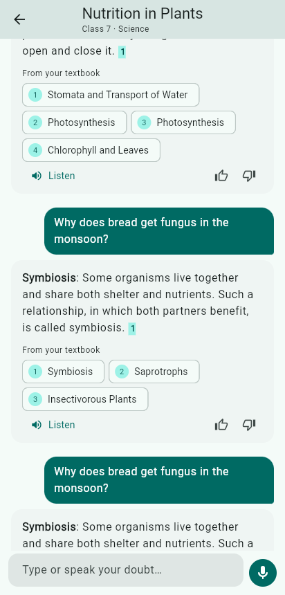
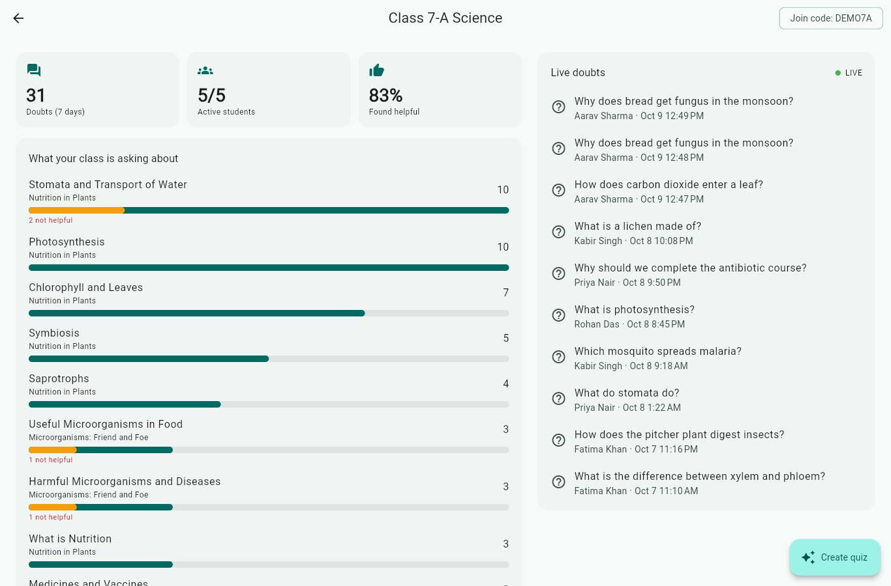
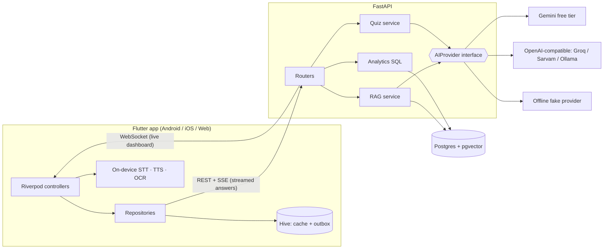

# Saathi (साथी): a voice-first study companion for Indian classrooms

A Class 7 student in a government school asks a doubt **by voice, in Hindi or English**. Saathi answers **only from their textbook chapter**, cites the exact passages it used, and reads the answer aloud. It still works when the network drops.

The teacher gets a **live dashboard** of the concepts the class is confused about this week. One tap generates a **remedial quiz that targets those concepts**.

> Student doubts → concept-level classroom insight → targeted practice → measured improvement.

<p>
  
  
</p>

| Student (Flutter · Android) | Teacher (Flutter · Web) |
|---|---|
| Ask by text, voice (on-device STT) or a photo of the textbook (on-device OCR) | Classroom heatmap of most-asked concepts, with "not helpful" signals |
| Answers stream word by word, with tappable `[S1]` textbook citations | Live doubt feed over WebSocket |
| Listen to the answer (on-device TTS, `hi-IN` / `en-IN`) | AI-generated quiz focused on the concepts the class asks about most |
| Works offline: doubts are queued and synced automatically | Per-student and per-question quiz results |
| Full UI in हिंदी and English | |

---

## Architecture



### How a doubt is answered
1. **Idempotency.** Each doubt carries a client-generated `client_id`. Retries and offline replays never create duplicates.
2. **Answer cache.** Normalised `(chapter, language, question)` hash. Repeated classroom questions cost **zero** LLM calls (answers marked 👎 are never reused).
3. **Retrieval.** The question is embedded, then a cosine search runs over an HNSW index, **scoped to the selected chapter**. A per-provider distance threshold rejects off-topic questions, so the model is told "no excerpts" instead of hallucinating.
4. **Grounded generation.** The prompt rules are: answer only from excerpts, cite `[S#]`, write for a 12-year-old, use Devanagari for Hindi with English technical terms in brackets. The answer streams to the phone over SSE.
5. **Free concept tagging.** Every chunk is stored with the section heading it came from. A doubt's concepts are the concepts of its retrieved chunks, so the teacher heatmap costs **no extra LLM call**.
6. **Live update.** The doubt is published to every classroom the student belongs to over WebSocket.

## Running it locally

**Prerequisites:** Docker, [uv](https://docs.astral.sh/uv/), Flutter 3.35+.

```bash
# 1. Backend: Postgres + API (migrations and demo seed run automatically)
docker compose up --build
#    → http://localhost:8000/docs

# 2. App
cd app
flutter run -d chrome          # teacher dashboard (web)
flutter run -d emulator-5554   # student app (Android emulator reaches the API at 10.0.2.2)
# Real phone on the same Wi-Fi:  flutter run --dart-define=API_BASE_URL=http://<your-LAN-IP>:8000
```

Demo logins (password `demo1234`): `student@saathi.dev`, `teacher@saathi.dev`. Class join code: `DEMO7A`.

### AI providers: free by default
With no keys, the backend uses a **deterministic offline provider**: hashed bag-of-words embeddings and extractive answers. Everything works end to end, which is also how the test suite runs. For real multilingual answers, copy `backend/.env.example` to `backend/.env`:

```bash
LLM_PROVIDER=gemini
EMBEDDING_PROVIDER=gemini
GEMINI_API_KEY=...        # free at https://aistudio.google.com/apikey
```

Switching embedding providers changes the vector space, so re-ingest afterwards: `docker compose down -v && docker compose up`.

Speech-to-text, text-to-speech and OCR all run **on-device**, so the per-request cloud cost is a single LLM call, and none at all for cached answers.

### Development without Docker for the API
```bash
docker compose up -d db
cd backend
uv sync
uv run alembic upgrade head
uv run python -m app.seed --sample-activity
uv run uvicorn app.main:app --reload
```

## Quality

| | |
|---|---|
| Backend tests | `cd backend && uv run pytest`: auth, RBAC, streaming, caching, idempotent offline sync, off-topic handling, insights, quiz lifecycle, WebSocket push (runs against real Postgres + pgvector) |
| App tests | `cd app && flutter test`: SSE parsing over chunked bytes (incl. Devanagari split mid-character), API error mapping, citation rendering, chat controller offline/retry/sync logic with fake repositories |
| Retrieval eval | `cd backend && uv run python -m scripts.eval_retrieval`: hit@1 / hit@k on 20 labelled EN+HI questions |
| CI | GitHub Actions: ruff, format, migrations up/down, pytest, `flutter analyze`, `flutter test` |

Retrieval eval (20 labelled questions, 3 in Hindi):

| Embeddings | hit@1 | hit@4 | Notes |
|---|---|---|---|
| Offline hashed bag-of-words | 80% | 90% | Every miss is a Hindi question: no shared tokens with English text |
| `gemini-embedding-001` (768d) | **100%** | **100%** | Cross-lingual: Hindi questions retrieve English textbook passages |

The off-topic threshold is **calibrated, not guessed**. With Gemini embeddings, on-topic questions had a top-1 cosine distance of 0.23–0.36 and unrelated ones ("Who won the 2011 World Cup?") 0.38–0.54, so the cut-off is 0.40. Off-topic doubts get no sources and no concept tags, which keeps the teacher heatmap clean.

### Model choice (measured on a Hindi grounded question)
| Model | First answer | Verdict |
|---|---|---|
| `gemini-3.1-flash-lite`, minimal thinking | ~2.2s | **Student answers**: follows every rule (citations, Devanagari + English terms, everyday example) |
| `gemini-3.5-flash-lite` | ~2.3s | Good, but dropped a citation |
| `gemini-3.5-flash`, minimal thinking | ~9.5s | **Quiz generation**: best quality, where latency matters less |
| `gemini-flash-latest` | — | Returned "high demand" errors; models are pinned instead of using `-latest` |

Streaming requests retry "high demand" / rate-limit errors automatically, but only before the first token is sent, so a student never sees a duplicated answer.

## Design decisions

- **RAG over fine-tuning.** Content changes every term and differs per state board. Retrieval keeps answers auditable (citations) and new chapters ingest in seconds (`POST /chapters` accepts PDF or Markdown).
- **SSE for answers, WebSocket for the dashboard.** Answers are one-way and request-scoped, and SSE works through proxies and is easy to retry. The dashboard needs a long-lived push channel.
- **Offline-first student app.** Lists are network-first with a Hive cache fallback. New doubts go to an outbox that is replayed on reconnect. Server-side idempotency makes replays safe.
- **On-device speech and OCR.** Zero cost, low latency, and keeps working on 2G. The server-side `AIProvider` boundary would let Indic speech models replace them where on-device quality is not enough.
- **Provider abstraction.** `LLMProvider` / `EmbeddingProvider` protocols. Swapping vendors is a config change, and tests never touch the network.
- **Teacher signal over vanity metrics.** The heatmap ranks concepts by doubt volume and highlights answers students marked unhelpful. That is where a teacher's 10 minutes of re-teaching pays off most.

## Project layout

```
backend/
  app/ai/            provider protocols + Gemini, OpenAI-compatible, fake
  app/services/      ingestion (chunking), rag, quiz, analytics, realtime hub
  app/routers/       auth, classrooms (+ WebSocket), chapters, doubts (SSE), quizzes
  app/seed/          demo data + two original Class 7/8 science chapters
  alembic/           migrations (pgvector + HNSW index)
  scripts/           retrieval evaluation
  tests/
app/lib/
  core/              API client (SSE), offline store, router, theme, shared widgets
  features/auth/
  features/doubts/   chat controller, outbox sync, on-device speech/TTS/OCR, ask screen
  features/classroom/ student home, teacher home, insights dashboard, live feed
  features/quiz/
  l10n/              English + Hindi strings
```